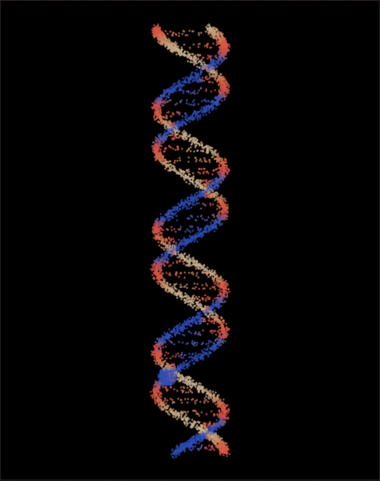
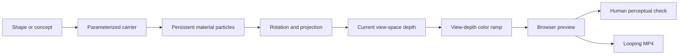
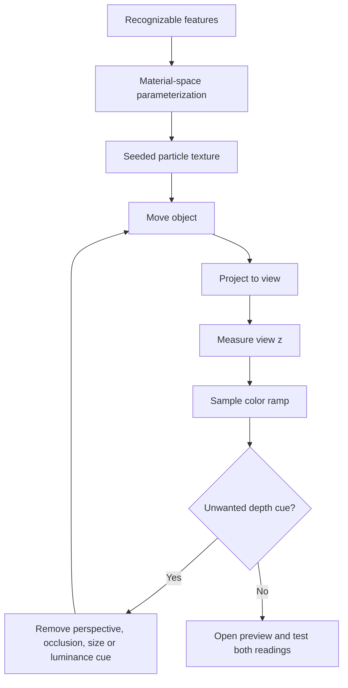

# Kinetic Illusion Workbench

<p align="center">
  
</p>

Turn a silhouette, curve, molecular helix, or ribbon into a rotating image that viewers can perceive as spinning in either direction.

A coding agent follows this skill to create a browser preview, test the animation loop, and export a video.

## What it makes

Provide an icon, molecule, letterform, animal, logo, ribbon, or abstract shape. The agent maps the subject to a carrier that preserves a defining gap, branch, loop, crossing, or endpoint.



Keep particle position and display color in separate coordinate systems:

```text
particle identity stays on the object
color is recomputed from current view-space depth
```

The examples use a cream → compressed red → cobalt ramp. If you change the palette, report each endpoint's Rec.709 luma and include a constant-luma comparison.

## Use it

Keep the folder intact because `SKILL.md` links to the included references and starter:

- **Codex:** Copy the folder to `$CODEX_HOME/skills/kinetic-illusion-workbench`, then start a new session.
- **Claude Code:** Copy the folder to `~/.claude/skills/kinetic-illusion-workbench`, then start a new session.
- **Other coding agents:** Give the agent access to this folder and tell it to read `SKILL.md` before it works.

In Codex, invoke it with:

```text
$kinetic-illusion-workbench
```

Example:

```text
Use $kinetic-illusion-workbench to turn a manta-ray silhouette into an ambiguous rotating particle stimulus. Build a browser preview and a shareable MP4 with matching loop frames.
```

For creation requests, the agent returns a browser preview, image, or video that you can open.

## Included examples

- [Readable browser starter](assets/starter/index.html): A self-contained template with named shape, carrier, camera, projection, color, and test functions.
- [Rotating arrow ribbon](assets/examples/arrow/index.html): A particle ribbon that uses the measured cylindrical geometry and inferred view-depth color rule.
- [Ambiguous DNA/RNA helix](assets/examples/helix/index.html): B-DNA and A-form RNA presets with viewer-aligned color and an interpretation control.
- [Example launcher](assets/examples/index.html): A page that links to the starter and both runnable studies.

Adapt the starter for a new subject. Open the two studies to inspect the completed arrow and helix effects.

## Reference

The arrow study measures its geometry and color ramp from the rotating-arrow animation in [Ramin Nasibov's post, “Which way is the arrow spinning?”](https://x.com/RaminNasibov/status/2092384791899386278). The helix applies the inferred view-depth color rule to B-DNA and A-form RNA.

## Method



Start with orthographic projection, constant particle size, no z-buffer occlusion, and a draw order unrelated to depth. Reserve stronger depth cues for explicit experiments.

## Repository map

```text
SKILL.md                         Agent workflow
references/shape-to-illusion.md Core generative method
references/rotating-depth-fields.md
references/helix-chirality.md
references/validation-and-export.md
assets/starter/                 Readable adaptation template
assets/examples/arrow/          Runnable arrow example
assets/examples/helix/          Runnable helix example
assets/examples/index.html      Example launcher
agents/openai.yaml              Optional Codex display metadata
LICENSE                         MIT license
```

## Requirements

The skill runs locally. Use browser automation to inspect the pages and FFmpeg to export MP4 files.

## License

MIT
